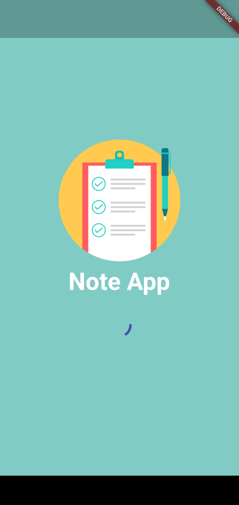
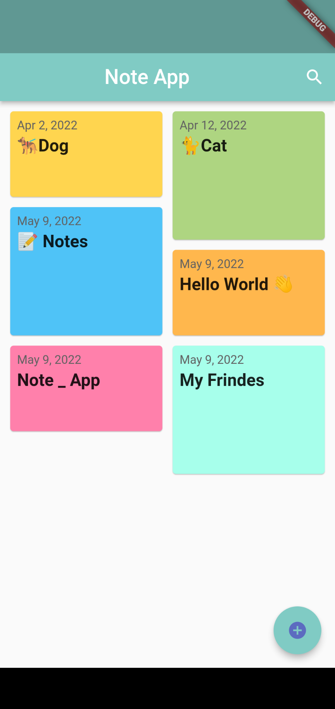
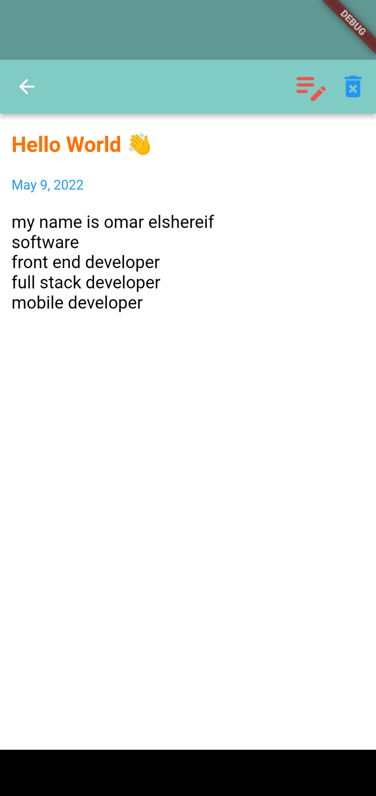
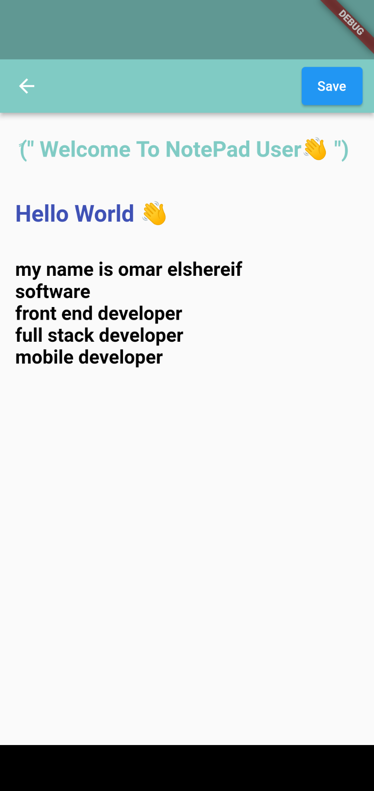

# Note_Pade Project

  

> Hawa is a mobile application that works on Android or iPhone, and it is a notebook that helps the user to save important comments to avoid forgetting .

## Description

> Hawa is a mobile application that works on Android or iPhone, and it is a notebook that helps the user to save important comments to avoid forgetting. In this notebook, you can add notes and edit them later from the pen button for modification, and you can also delete the notes if they are not important to you now from the basket button. Thank you I hope you enjoy .

## Development

* [x] **Flutter** 
* [x] **Dart**
* [x] **My Squale**

## ScreenShots

